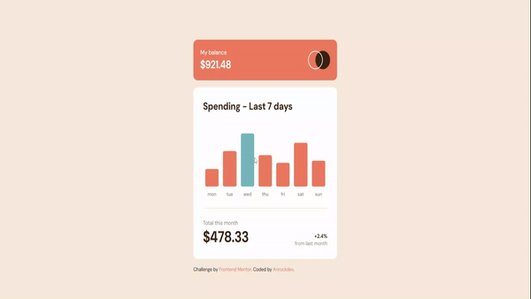

# Expenses chart component

"This app is a component that calculates weekly expenses and displays a bar graph with daily expenses."


### Features of the app

- Mobile-friendly responsive interface

- Modern design with Flexbox and Grid CSS

- Ease of adaptation for other types of measurement displays  


## Project Demostration





### Live demo Project [here](https://expenses-chart-component-main-fm.netlify.app/)

If you want to try this app

1- clone the repository

```bash


```

2- open the `index.html` file in your browser


## For the app I used


* HTML 

* CSS: CSS Flexbox and Grid

* JAVASCRIPT: Since I didn't have an API for this project, I used a json file, and decided to put into practice some OOP concepts.
You can see that I've used classes, class instances, methods, as well as modularized the javascript code to make it more readable.
I have to say that this is my first project where I put into practice OOP, especially in javascript.

This project belongs to the following [Frontend Mentor](https://www.frontendmentor.io/)

